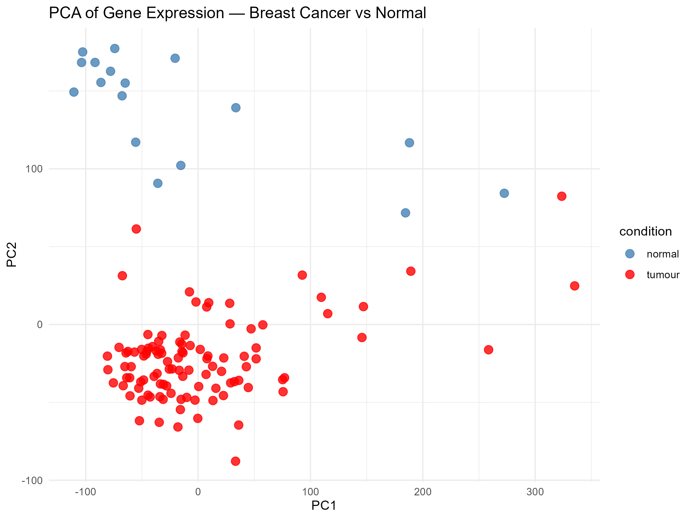
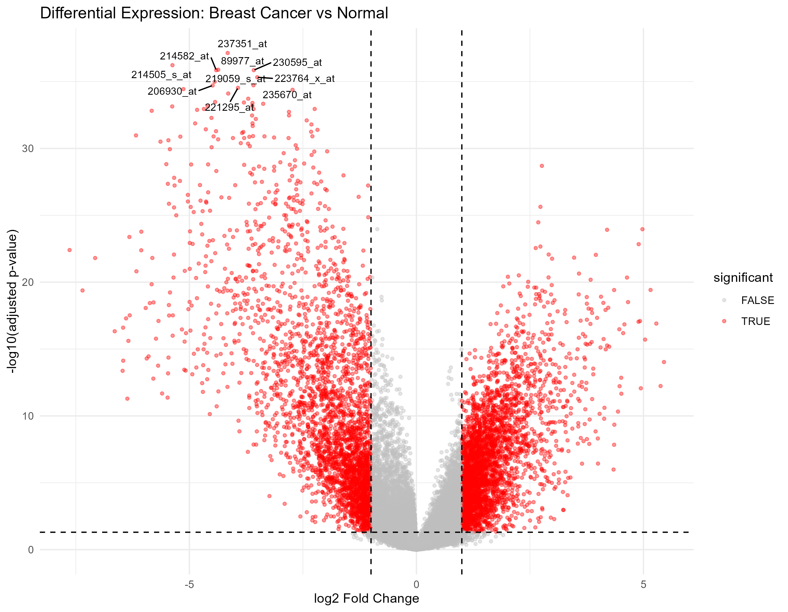
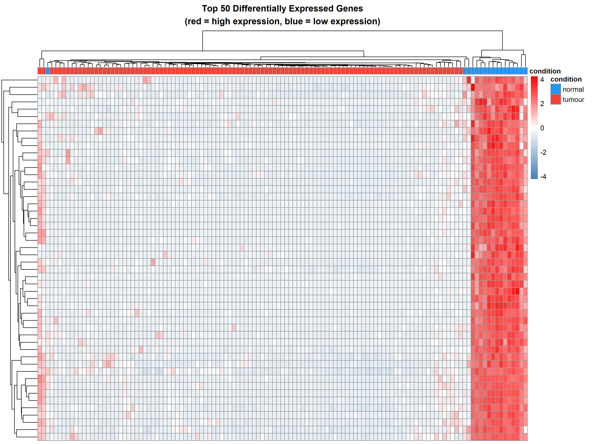

# Gene Expression Analysis in Breast Cancer
### Differential Expression + Machine Learning Classification using Microarray Data (Affymetrix U133 Plus 2.0)


## Overview

This project analyses publicly available microarray gene expression data (GSE42568)
to identify differentially expressed genes between breast cancer and healthy tissue,
and builds a machine learning classifier to predict disease status from expression profiles.

**Skills demonstrated:** R/Bioconductor, DESeq2, Python, scikit-learn, data visualisation,
reproducible research, biological data interpretation.

## Biological Question

> Which genes are significantly up- or down-regulated in breast cancer compared to
> normal tissue, and can we use gene expression profiles to classify samples accurately?

## Dataset

- **Source:** NCBI Gene Expression Omnibus — [GSE42568](https://www.ncbi.nlm.nih.gov/geo/query/acc.cgi?acc=GSE42568)
- **Samples:** 17 normal breast tissue + 104 primary breast tumour samples (121 total)
- **Platform:** Affymetrix Human Genome U133 Plus 2.0 Array
- **Access:** Free, publicly available

## Methods

### 1. Differential Expression Analysis (R / limma)
- Loaded and normalised microarray data using limma
- Identified significantly differentially expressed genes (padj < 0.05, |log2FC| > 1)
- Visualised results with volcano plots and heatmaps

### 2. Machine Learning Classifier (Python / scikit-learn)
- Reduced dimensionality with PCA
- Trained and evaluated Logistic Regression and Random Forest classifiers
- Used 5-fold cross-validation to assess performance

## Results

| Model | AUC-ROC |
|-------|---------|
| Logistic Regression | 0.997 ± 0.005 |
| Random Forest | 0.978 ± 0.044 |

**Top 10 upregulated in cancer:** 239811_at, 235927_at, 202178_at, 200606_at, 210715_s_at, 225846_at, 244803_at, 213593_s_at, 201418_s_at, 226129_at

**Top 10 downregulated in cancer:** 237351_at, 214505_s_at, 89977_at, 230595_at, 214582_at, 223764_x_at, 219059_s_at, 235670_at, 206930_at, 221295_at

## Repository Structure

```
├── data/
│   ├── raw/          # original GEO data (not uploaded — see download instructions)
│   └── processed/    # normalised count matrix
├── notebooks/
│   ├── 01_exploration.ipynb
│   ├── 02_differential_expression.Rmd
│   └── 03_ml_classifier.ipynb
├── scripts/
│   ├── deseq2_analysis.R
│   └── classifier.py
└── results/
    ├── figures/      # all plots
    └── tables/       # DE gene lists, model metrics
```

## How to Reproduce

### Requirements

**R packages:**
```r
BiocManager::install("DESeq2")
BiocManager::install("GEOquery")
install.packages(c("ggplot2", "pheatmap", "ggrepel", "dplyr"))
```

**Python packages:**
```
pip install -r requirements.txt
```

### Download the data

```r
# Run this in R to download the dataset automatically
library(GEOquery)
gse <- getGEO("GSE42568", GSEMatrix = TRUE)
```

### Run the analysis

1. Open `notebooks/02_differential_expression.Rmd` in RStudio and knit
2. Open `notebooks/03_ml_classifier.ipynb` in Jupyter and run all cells

## Key Visualisations
## Key Visualisations


*PCA of all 121 samples — normal (blue) and tumour (red) samples separate naturally along PC1, confirming gene expression profiles differ between conditions.*


*Volcano plot of 54,675 genes — red dots are the 6,472 significantly differentially expressed genes (padj < 0.05, |log2FC| > 1). Top gene 237351_at is the most statistically significant.*


*Heatmap of top 50 DE genes — normal samples (right, red) show high expression while tumour samples (left, blue) show consistently low expression, indicating these genes are switched off in cancer.*
## Biological Interpretation

### What is PC2 capturing?
The normal samples cluster high on PC2 while tumour samples sit low. 
The genes driving PC2 explain why:

| Gene | Full Name | Role in Cancer |
|------|-----------|----------------|
| FHL1 | Four and a Half LIM Domain Protein 1 | Known tumour suppressor — frequently switched off in breast cancer |
| VGLL3 | Vestigial Like Family Member 3 | Directly linked to breast cancer, controls cell growth |
| ACVR1C | Activin Receptor Type 1C | Part of TGF-beta signalling pathway, commonly disrupted in cancer |
| ACSM5 | Acyl-CoA Synthetase Medium Chain 5 | Fatty acid metabolism, altered in tumour tissue |
| PDE3B | Phosphodiesterase 3B | Insulin signalling, disrupted in cancer metabolism |

**Interpretation:** PC2 is capturing tumour suppressor activity. Normal samples score high 
because these protective genes are still active. Cancer samples score low because these 
genes have been switched off — a hallmark of cancer progression.

### What is PC1 capturing?
PC1 separates samples along a general cancer vs normal axis, driven by:

| Gene | Full Name | Role |
|------|-----------|------|
| RBFOX1 | RNA Binding Fox-1 Homolog 1 | RNA splicing regulator — cancer cells often show abnormal splicing |
| OCIAD1 | OCIA Domain Containing 1 | Mitochondrial function — relates to altered cancer cell metabolism |
| CCDC163 | Coiled-Coil Domain Containing 163 | Less well studied |

**Interpretation:** PC1 broadly captures metabolic and cellular stress differences 
between cancer and normal tissue.

## What I Learned

-How microarray gene expression data is structured and normalised
- Statistical methods for differential expression using limma (moderated t-test, Benjamini-Hochberg correction)
- How to reduce high-dimensional biological data with PCA before ML
- The challenges of class imbalance in biological datasets

## About

Created during winter break 2026 as a self-directed bioinformatics project.  
BSc (Biochemistry & Molecular Biology / Data Science) — University of Sydney.

**Contact:** [klau0673@uni.sydney.edu.au] |[linkedin.com/in/kenny-lau-a41bbb3a9]
